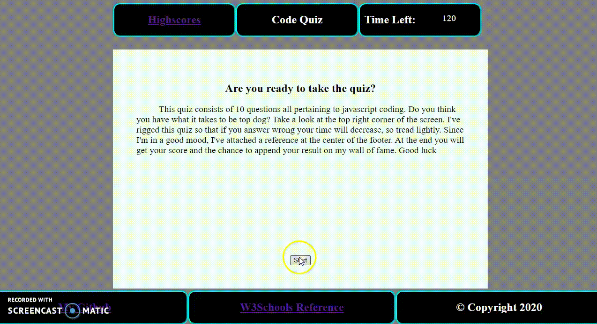

# code-Quiz
By: ```Wesley Tejeda```

Deployed link: [https://wesleytejeda.github.io/code-Quiz]

My GitHub : [https://github.com/wesleytejeda]
## General:
In this repository I was tasked with creating a javascript quiz that users could save their scores. My quiz gives the user a score of how many seconds they have left when ending the quiz.

## Preview
Quick demo down below of quiz, post-quiz page and highscores page


## My Approach in detail
First I designed two pages of html, one for the quiz and one for the highscores page. The quiz html will present a landing page with a brief description of the quiz and a start button. When clicking the start button a timer will be set in motion, the first question populates, the start button will disappear, and finally the radio input form will appear. I used an array of objects to store the question information, choices, answers, and user answers.  These are the main buttons and how they work:

    ### Lock in button
    When the user clicks on a radio input and then locks in their answer, there will be a text field that confirms their choice and the user answer is inputted to the array.

    ### Next button
    When the user has locked in their choice then they can click on the next button. In doing so we go to the next item in the array and pull the next question information and display it. While this is happening we are checking to see if their answer reflects the correct answer. If the answer is correct, we store the times the user is right; but if the answer is wrong then 10 seconds are subtracted from total time.

    ### Submit Button
    When the timer runs out or the quiz is completed then the text fields in ```index.html``` are overwritten and the radio inputs will disappear. We get to a page that has the user's score as well as their time left. The user can input their name and in doing so their name and time will be saved to local storage.

Once the user has submitted their score they can head to the highscores page which will display all names and scores in order from highest score to least. This is done by iterating through the local storage elements and assigning the key pairs to an object which is then store in an array. 

## Key features

### Time stamps
When the user submits their score a string of date info is stored with their name, this is later stripped when pushing into our array. This allows users to have multiple entries without overwriting their previous quiz result, thus saving their multiple scores.
### Swap Sort algorithm
When the key pairs (name and score) are assigned in our key pair array and every local storage is extracted we move to the sorting phase. I decided to use a swap sort algorithm that swap indices of our array of objects to display the array in descending order. The sort is shown below
```
for(var i=x+1; i < keyValArray.length;i++){
            if(parseInt(keyValArray[x].Score) < parseInt(keyValArray[i].Score)){
                var temp1 = keyValArray[x].Score;
                var temp2 = keyValArray[i].Score;
                var temp3 = keyValArray[x].Name;
                var temp4 = keyValArray[i].Name;
                var temp5 = keyValArray[x].Time;
                var temp6 = keyValArray[i].Time;

                keyValArray[x].Score = temp2;
                keyValArray[i].Score = temp1;
                keyValArray[x].Name = temp4;
                keyValArray[i].Name = temp3;
                keyValArray[x].Time = temp6;
                keyValArray[i].Time = temp5;
            }
        }
```
### Element exists function
Both HTML pages share the same ```script.js``` file. In order to do this I will need this function,
```
function eleExists(arg1){
    if(arg1 !== null)
        return true;
    else
        return false;
};
```
where the arg1 would be the variables we assign to our button id's. This is called in an if statement before any buttons are added an on click event, like so 
```
if(eleExists(startButton)){
    startButton.addEventListener("click", function(){...
```
This needed because these buttons could exist on one html page but not on the other and we run into errors.

If you would like to try your chances at my quiz visit (wesleytejeda.github.io/code-Quiz)